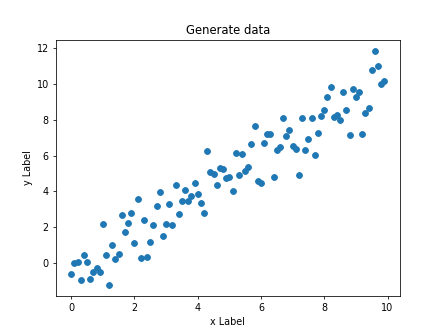
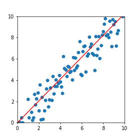

# metode pembelajaran dalam machine learning

- [supervised learning](#supervised-learning)
- [unsupervised learning]
- [reinforcement learning]

### supervised learning
- Decision Tree
- [Regresi linier](#Regresi-linier)
- naive bayes
- nearest neighbor
- neural network
- dll

#### Regresi linier

Regesi linier adalah analisa untuk mempelajari dan mengukur hubungan yang terjadi antara 2 variable atau lebih (wahyono,2018)

hubungan antara 2 variable

- lama belajar :clock10: -> nilai kuliah 

apakah lama belajar mempengaruhi nilai kuliah?

apakah jika semakin lama dia belajar maka nilai dia semakin bagus?

- tingkat pendidikan :mortar_board: -> penghasilan :dollar:

apakah semakin tinggi tingkat pendidikan mempengaruhi penghasilan seseorang?

- Besaran promosi -> nilai penjualan

variable y 

variable y adalah variable terikat/dependent(yang dipengaruhi)

variable terikat (y) dalam penelitian merupakan respon (outcome) yang di ukur akibat perlakuan variable bebas (x)

variale x

variable x adalah variable bebas/independent(yang mempengaruhi)

garis merah itu adalah garis yang diukur oleh rumus :

$y = \alpha + \beta x $

$ \alpha$ = konstanta 

$ \beta $ = koefisien regresi (besaran yang ditimbulkan $x$)

Fungsi regresi linier
- Melihat hubungan
- Membuat estimasi
- melakukan prediksi